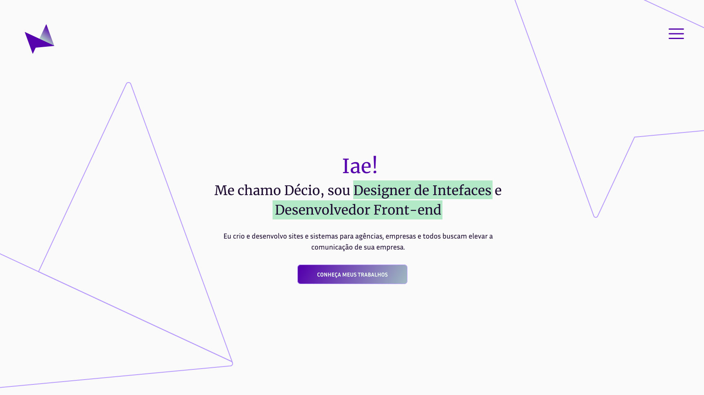

# My Website (in progress)
Personal website to post my projects and jobs.

## Overview

### Test the project:

- clone or fork the repository;
- run **npm install** for the dependences;
- **npm run dev** to start the server and open on http://localhost:3000 in the browser.

## My process

### Built with

- Next js;
- Typescript;
- Styled-components;
- Material UI;

## Author

- Linkedin - [Décio Neto](https://www.linkedin.com/in/decioneto/) 👋